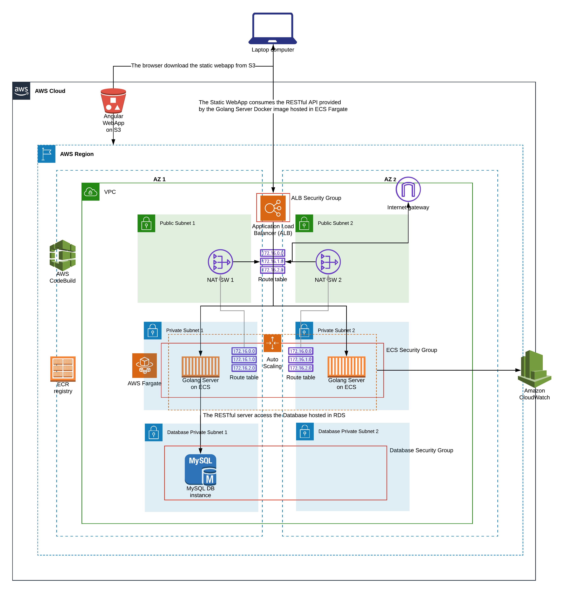
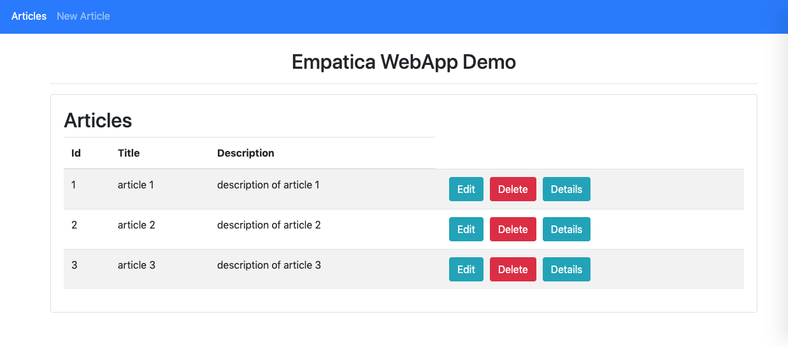

# Empatica AWS Stack

This project uses Terraform to create the AWS resources for the Empatica Challenge 1.

**IMPORTANT**: I didnt' use the provided [Simple App](http://developer.empatica.com/empamini/qa_demo.zip) (both Angular FE and Golang BE), but I wrote from scratch a custom Angular 8 FE and a Custom Goland RESTful server.

***Why?***

Basically I did a mistake. Initially when I read the Challenge 1 description I didn't follow the link to the [Simple App](http://developer.empatica.com/empamini/qa_demo.zip), So I assumed I have to write myself the WebApp and RESTful server to deploy in AWS.
So I started coding before the BE and then the FE.

In the following days, when I realized you provided the Simple WebApp, I decided to go ahead with the custom  projects, because I was finalizing the project.

**PLEASE NOTE**: I didn't know both Golang and Angular so it took more time in order to create the **Full Stack**, but it was funny :-)

## Full Stack Projects 

Basically I created diffent projects for this Challenge:

1. [Empatica Angular Webapp](https://github.com/thecillu/empatica-webapp): Angular 8 WebApp which consume the RESTful APIs from the Golang Server
2. [Empatica Golang Server](https://github.com/thecillu/empatica-server): GoLang Server which exposes RESTful APIs to manage `Articles`. It persists the Articles in a Relational Database (Mysql) and use a Database Migration project [golang-migrate](http://github.com/golang-migrate/migrate) to manage every changes to the database
3. [Empatica Server Builder](https://github.com/thecillu/empatica-server-build): Terraform project which creates an AWS CodeBuild project to creates a Docker images from the [Empatica Golang Server](https://github.com/thecillu/empatica-server) project and save it in a AWS registry
4. [Empatica WebApp Deployer](thecillu/empatica-webapp-deploy): Terraform project which creates the an AWS CodeBuild project to build the Angular WebApp FE starting from the [Empatica Angular Webapp](https://github.com/thecillu/empatica-webapp) project, and copy it in a dedicated **S3 Bucket** with hosting enabled
5. [Empatica AWS Stack (this project)](https://github.com/thecillu/empatica-aws-stack): Terraform project which creates all the resources needed to deploy in AWS the BE (in **ECS Fargate**), the FE (in a **S3 Bucket**) and the Mysql Database (in **RDS**)

## AWS Architecture and Resources

This Terraform project:

1. Create a VPC
2. Create the public subnets and the related Internet Gateway and Routing Tables
3. Create the private subnets and the related NAT Gateways and Routing Tables
4. Create and ECS Cluster (Fargate) which host the RESTFul server Docker Image and deploy into the private subnets
5. Configure the Autoscaling policies for the ECS Cluster
6. Create an Application Load Balancer which Listen on port 80 and forward the request to the ECS Target Groups
7. Create a Mysql RDS Instance and a default database in the private subnets
8. Create the needed Security Groups for the flow ALB --> ECS and ECS --> RDS
9. Finally, Deploy in a ECS Fargate Cluster the built [Empatica Golang Server](https://github.com/thecillu/empatica-server) *Docker Image* stored in the AWS registry
10. Provide in output the the created ALB address (example: 
alb_hostname = empatica-load-balancer-1789365880.eu-central-1.elb.amazonaws.com)

This Diagram shows the high level architecture:

## How to Deploy the BE and the FE

### Requirements

##### AWS Credentials

The Terraform configuration reads the credentials from the file: 

`$HOME/.aws/credentials`

Make sure to put in this file the `aws_access_key_id` and `aws_secret_access_key` of a valid AWS User.

##### AWS Region

The Terraform configuration uses the variable `aws_region` to indentify the target AWS Region.

By Default the deployment Region is `eu-central-1`.

## Step by Step Guide

**1. Build the Docker Image of the Golang Server**

- Clone the Project [Empatica Server Builder](https://github.com/thecillu/empatica-server-build)

- Change dir to `empatica-server-build/terraform`

- Init the Terraform project with the command:

`terraform init`

- Run the Terraform project to create the AWS CodeBuild project with the command:

`terraform apply -var="aws_region=eu-central-1"`

- Launch the AWS Codebuild to create the create the Docker Image and store in a AWS Registry (ECR):

`aws codebuild  start-build --project-name empatica-server-build --source-version master --region eu-central-1`

At the end of the CodeBuild project, the ECR registry will contain the Golang Docker Image tagged as `master` and `latest`

**2. Deploy the AWS Stack and the Golang Server Docker Image in AWS**

- Clone this Project [Empatica AWS Stack](https://github.com/thecillu/empatica-aws-stack)

- Change dir to `empatica-aws-stack/terraform`

- Init the Terraform project with the command:

`terraform init`

- Run the Terraform project to create all the AWS Resources for the BE, FE, Database and Deploy the `latest` built Golang Docker Image stored in ECR:

`terraform apply -var="aws_region=eu-central-1`

When completed, Terraform will provide in output the address of the created Load Balancer for the Golang Server deployed in ECS Fargate:

Example: `alb_hostname = empatica-load-balancer-1789365880.eu-central-1.elb.amazonaws.com`

*Wait 1 or 2 minutes until the ALB/ECS Cluster is ready*

Open the browser to the address `http://empatica-load-balancer-1789365880.eu-central-1.elb.amazonaws.com/articles` to get the 3 Articles created by the Database Migration files in the Golang Server.

**IMPORTANT**: Take note of the `ALB address` because we need to configure it in the Angular WebApp later

**3. Configure the ALB address in the Angular WebApp project**

- Clone this Project [Empatica Angular Webapp](https://github.com/thecillu/empatica-webapp)

- Change dir to `empatica-webapp`

- Open the prod environment file to the path `src/environments/environment.prod.ts` and change the variable apiBaseUrl with the ALB address created before:

Example:
`export const environment = {
  production: true,
  apiBaseUrl: 'http://empatica-load-balancer-1789365880.eu-central-1.elb.amazonaws.com/articles'
};`

- Commit and push the changed File into the Remote `master` branch

**4. Build and Deploy the Angular WebApp in the S3 bucket**

- Clone the Project [Empatica WebApp Deployer](https://github.com/thecillu/empatica-webapp-deploy)

- Change dir to `empatica-webapp-deploy/terraform`

- Init the Terraform project with the command:

`terraform init`

- Run the Terraform project with the command:

`terraform apply -var="aws_region=eu-central-1`

When completed, Terraform will provide in output the website endpoint of the S3 bucket:

Example: `empatica-webapp.s3-website.eu-central-1.amazonaws.com`

- Launch the AWS Codebuild to build the Angular WebApp starting from the [Empatica Angular Webapp](https://github.com/thecillu/empatica-webapp) sources and deploy it to the S3 Bucket:

`aws codebuild  start-build --project-name empatica-webapp-build --source-version master --region eu-central-1`

At the end of the CodeBuild project, the S3 Bucket will host the Angular WebApp.

You can access it to the website endpoint created before:

Example:
http://empatica-webapp.s3-website.eu-central-1.amazonaws.com

You should see the WebApp articles's page:

Enjoy!
